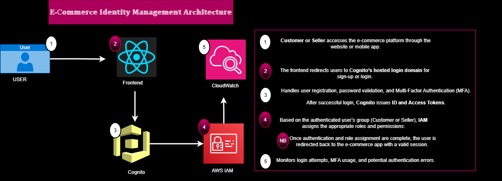

# E‑Commerce Identity Management Architecture (COGNITO PROJECT)

> Part of the **#52WeeksAWSDevOpsChallenge** — Week 5: Implementing AWS Cognito for E‑Commerce Authentication.

This repository (named `52WeeksAWSDevOpsChallenge‑Week‑5‑Cognito‑E‑Commerce‑Auth`) is my Week 5 submission for the #52WeeksAWSDevOpsChallenge. It showcases a secure authentication and authorization architecture for an e‑commerce platform using AWS Cognito, IAM, and CloudWatch.  

##  Architecture Overview



###  Flow Description

**1. Customer or Seller**  
Accesses the e-commerce platform through the main website to browse products or manage store listings.

**2. E-Commerce Frontend (index.html)**  
Handles user interactions and redirects users to **AWS Cognito’s hosted login domain** for authentication.

**3. AWS Cognito (Authentication Service)**  
Manages:
- User registration and login  
- Password validation and reset  
- Multi-Factor Authentication (MFA)  
- Issuance of **ID** and **Access Tokens**

**4. AWS IAM (Role Assignment)**  
After successful authentication, **IAM** assigns access permissions based on user type:
- **Customer:** Browse products, add to cart, make purchases  
- **Seller:** Manage inventory, view sales data, and update listings  

**5. AWS CloudWatch (Monitoring & Logging)**  
Tracks login events, MFA usage, and anomalies such as repeated login failures.  
Helps detect suspicious activity and maintain account security.

---

```
##  Project Structure

Capstone Project/
├── diagrams/
│   └── cognito_project.drawio.png   # Architecture diagram
├── index.html                       # Main landing page
├── log_in.html                       # Login interface connected to AWS Cognito
├── log_out.html                      # Logout flow and session termination
└── README.md                         # Project documentation

```

---

##  Technologies Used
- **AWS Cognito** – Authentication and identity management  
- **AWS IAM** – Role-based access control  
- **AWS CloudWatch** – Authentication monitoring and alerting  
- **HTML5 / JavaScript** – Frontend implementation  

---

##  Getting Started

### Prerequisites
- AWS Account  
- AWS CLI configured locally  
- Cognito User Pool and App Client created  

### Setup Steps
1. Configure **Cognito** and **IAM** roles in AWS.  
2. Update `log_in.html` with your Cognito User Pool and App Client details.  
3. Use `index.html` as your e-commerce homepage.  
4. Connect **CloudWatch** to monitor login activity.  
5. Open the project locally or deploy to S3/Amplify for hosting.

---

##  Security Best Practices
- Enforce **MFA** for all sellers and admin roles.  
- Enable **CloudWatch Alarms** for suspicious login attempts.  
- Use **HTTPS** when hosting your site.  

---

##  Summary
This **Capstone Project** showcases a simple yet powerful AWS-based authentication flow for an e-commerce environment.  
By integrating Cognito, IAM, and CloudWatch, the system ensures secure user access, role-based control, and active monitoring.

---

**Author:** _Samuel Nartey Otuafo_  
**Last Updated:** October 2025
